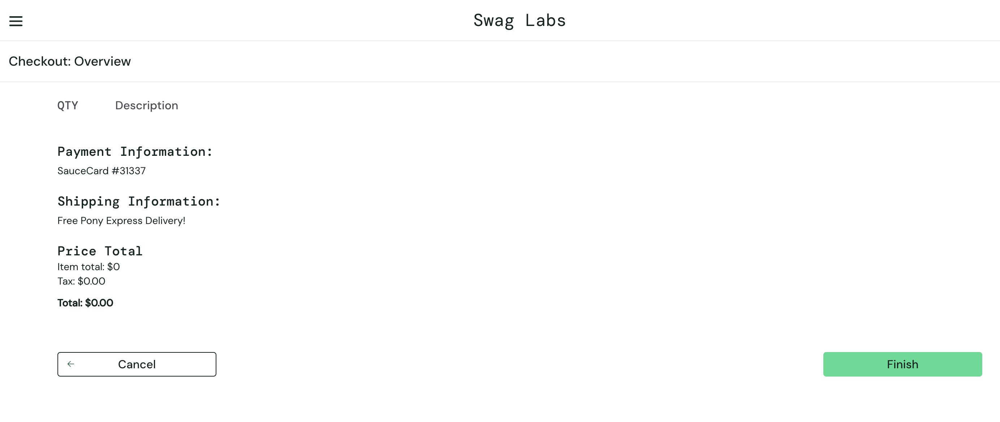
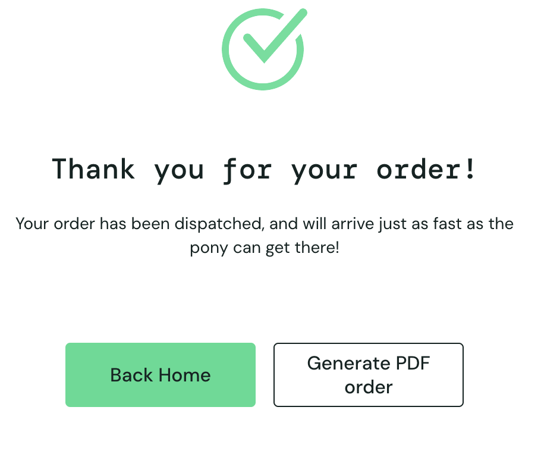
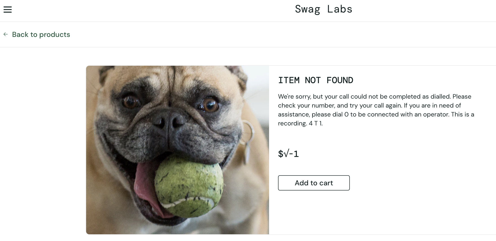
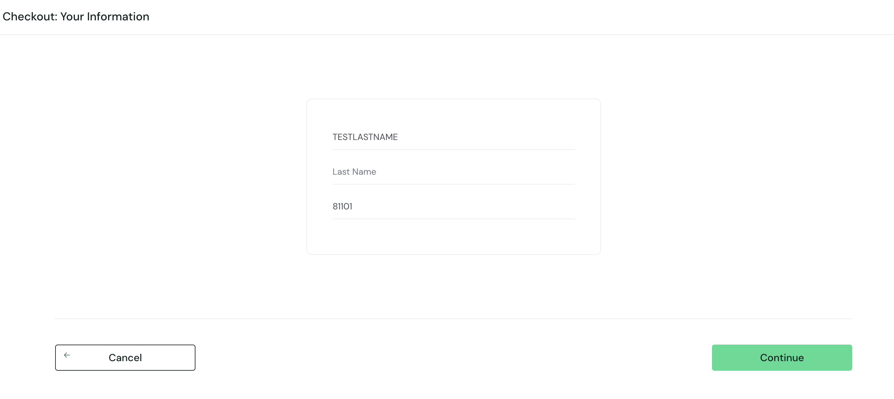
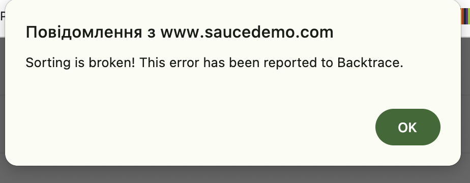
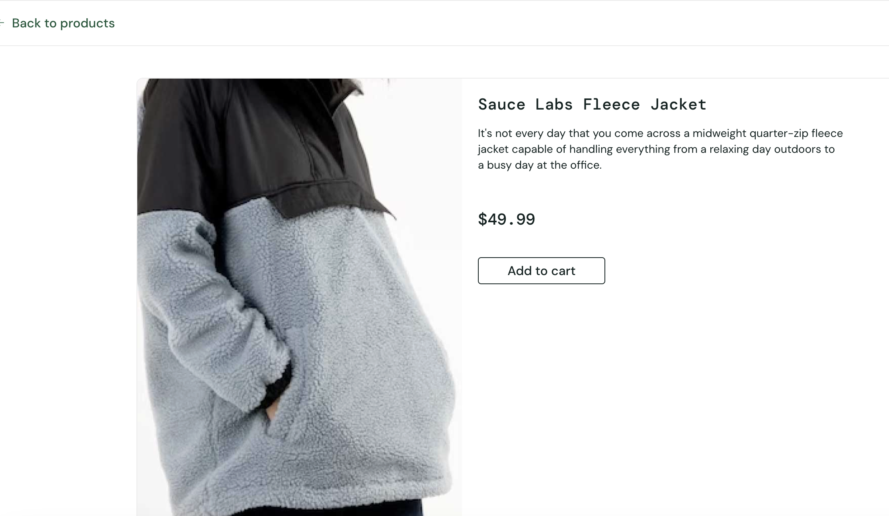

# Bug Reports

## BUG-001 — Checkout can be completed with an empty cart

**Severity:** High  
**Priority:** High  
**Type:** Functional / Business Logic

### Environment
- Application: SauceDemo
- Platform: Desktop Web
- Browser: Google Chrome
- Test Account: standard_user

### Preconditions
- User is logged in.
- Shopping cart is empty.

### Steps to Reproduce
1. Open the shopping cart.
2. Click the Checkout button.
3. Enter valid customer information.
4. Click Continue.
5. Click Finish.

### Actual Result
Checkout is completed successfully and a purchase confirmation message is displayed even though the shopping cart is empty.

### Expected Result
Checkout should not be completed when the shopping cart contains no products.

### Impact
The application allows an invalid order with no products to be completed.

### Evidence

Checkout Overview with an empty order:

Successful purchase confirmation after submitting the empty order:

## BUG-002 — Invalid product data is displayed for Sauce Labs Fleece Jacket

**Severity:** High  
**Priority:** High  
**Type:** Functional / Data

### Environment
- Application: SauceDemo
- Platform: Desktop Web
- Browser: Google Chrome
- Test Account: problem_user

### Preconditions
- User is logged in as `problem_user`.
- Products page is displayed.

### Steps to Reproduce
1. Locate `Sauce Labs Fleece Jacket`.
2. Open the Product Details page.

### Actual Result
Invalid product information is displayed:
- Product name: `ITEM NOT FOUND`
- Unexpected system text is displayed as the description
- Product price is displayed as `$√-1`

### Expected Result
The Product Details page should display the correct product name, description, and price for Sauce Labs Fleece Jacket.

### Impact
Users receive invalid and misleading product information.

### Evidence

Invalid product information displayed on the Product Details page:

.

## BUG-003 — Add to Cart works only for specific products

**Severity:** High  
**Priority:** High  
**Type:** Functional / Shopping Cart

### Environment
- Application: SauceDemo
- Platform: Desktop Web
- Browser: Google Chrome
- Test Accounts:
  - problem_user
  - error_user

### Preconditions
- User is logged in as either `problem_user` or `error_user`.
- Products page is displayed.
- Shopping cart is empty.

  ### Reproducibility
Reproduced with:
- problem_user
- error_user
  
### Steps to Reproduce
1. Review the products displayed on the Products page.
2. Click Add to cart for different products one by one.
3. Observe the button state and cart badge after each attempt.

### Actual Result
Only specific products can be added to the shopping cart.
For other products, clicking Add to cart does not add the product and the cart state is not updated.

### Expected Result
Each available product should be added to the shopping cart when the user clicks Add to cart.

### Impact
Users are unable to purchase some available products.

## BUG-004 — Last Name input appears in First Name field

**Severity:** High  
**Priority:** High  
**Type:** Functional / Form Input

### Environment
- Application: SauceDemo
- Platform: Desktop Web
- Browser: Google Chrome
- Test Account: problem_user

### Preconditions
- User is logged in as `problem_user`.
- Checkout Information page is displayed.

### Steps to Reproduce
1. Click the Last Name field.
2. Enter text into the Last Name field.

### Actual Result
Entered characters appear in the First Name field.
The Last Name field remains empty.

### Expected Result
Entered characters should appear only in the Last Name field.

### Impact
Users cannot correctly enter customer information required for checkout.

### Evidence

Text entered into the Last Name field appears in the First Name field:

## BUG-005 — Remove button does not remove supported products outside the Shopping Cart

**Severity:** Medium  
**Priority:** High  
**Type:** Functional / Shopping Cart

### Environment
- Application: SauceDemo
- Platform: Desktop Web
- Browser: Google Chrome
- Test Accounts:
  - problem_user
  - error_user

### Preconditions
- User is logged in as either `problem_user` or `error_user`.
- One of the products that can be successfully added to the cart has been added.
- The Add to cart button has changed to Remove.

 ### Reproducibility
Reproduced with:
- problem_user
- error_user
  
### Steps to Reproduce
1. Add one of the supported products to the shopping cart.
2. Verify that the Add to cart button changes to Remove.
3. Click Remove on the Products page or Product Details page.
4. Observe the button state and cart badge.
5. Open the Shopping Cart page.
6. Remove the same product from inside the cart.

### Actual Result
For products that can be successfully added to the cart:
- The Add to cart button changes to Remove.
- Clicking Remove on the Products page or Product Details page does not correctly remove the product.
- The button does not change back to Add to cart.
- The cart badge is not updated correctly.
- The same product can be removed successfully from inside the Shopping Cart page.

For products that cannot be added to the cart, the button never changes to Remove.

### Expected Result
For any product that has been added to the cart:
- Clicking Remove on the Products page or Product Details page should remove the product from the cart.
- The button should change back to Add to cart.
- The cart badge should be updated.

### Impact
Users can add only some products to the cart, and even for those products the cart state cannot be managed correctly outside the Shopping Cart page.

## BUG-006 — Product sorting displays an application error

**Severity:** Medium  
**Priority:** High  
**Type:** Functional / Sorting

### Environment
- Application: SauceDemo
- Platform: Desktop Web
- Browser: Google Chrome
- Test Account: error_user

### Preconditions
- User is logged in as `error_user`.
- Products page is displayed.

### Steps to Reproduce
1. Open the product sorting dropdown.
2. Select any sorting option, for example `Name (Z to A)`.
3. Observe the product list and displayed message.

### Actual Result
Products are not sorted according to the selected option.

The application displays the error:

`Sorting is broken! This error has been reported to Backtrace.`

### Expected Result
Products should be reordered according to the selected sorting option without displaying an application error.

### Impact
Users cannot use product sorting functionality.

### Evidence

Sorting error displayed after selecting a sorting option:

## BUG-007 — Product card displays information for a different product

**Severity:** High  
**Priority:** High  
**Type:** Functional / Data Mapping

### Environment
- Application: SauceDemo
- Platform: Desktop Web
- Browser: Google Chrome
- Test Account: problem_user

### Preconditions
- User is logged in as `problem_user`.
- Products page is displayed.

### Steps to Reproduce
1. Locate a product card on the Products page.
2. Note the displayed product name and price.
3. Click the product name or image to open the Product Details page.
4. Compare the product name, price, and image with the information displayed in the catalog.

### Actual Result
The product card on the Products page displays the name and price of one product.

After opening the product, the Product Details page displays the name and price of a different product.

The product image on the Product Details page corresponds to the product shown in the details.

### Expected Result
The product opened from the Products page should match the selected product card.

The product name, price, image, and other product information should remain consistent between the Products page and the Product Details page.

### Impact
Users may select one product from the catalog but be redirected to a different product.

This can cause confusion and may result in users purchasing a product different from the one they intended to select.

### Evidence

Product information displayed on the Products page:

Product Details page opened from the same product card:

## BUG-008 — Product prices change after page refresh

**Severity:** High  
**Priority:** High  
**Type:** Functional / Data

### Environment
- Application: SauceDemo
- Platform: Desktop Web
- Browser: Google Chrome
- Test Account: visual_user

### Preconditions
- User is logged in as `visual_user`.
- Products page is displayed.

### Steps to Reproduce
1. Note the displayed product prices.
2. Refresh the Products page.
3. Compare the prices before and after the refresh.
4. Repeat the refresh if necessary.

### Actual Result
Product prices change unexpectedly after refreshing the page.

### Expected Result
Product prices should remain consistent after page refresh unless the product data has intentionally changed.

### Impact
Users receive inconsistent pricing information and may not know the actual product price.

## BUG-009 — Finish button does not complete checkout

**Severity:** High  
**Priority:** High  
**Type:** Functional / Checkout

### Environment
- Application: SauceDemo
- Platform: Desktop Web
- Browser: Google Chrome
- Test Account: error_user

### Preconditions
- User is logged in as `error_user`.
- At least one product is in the shopping cart.
- User has reached the Checkout Overview page.

### Steps to Reproduce
1. Complete the checkout information with valid data.
2. Continue to Checkout Overview.
3. Click the Finish button.

### Actual Result
Clicking the Finish button does not complete the checkout process.

### Expected Result
Checkout should be completed and the order confirmation page should be displayed.

### Impact
Users cannot complete their purchase.

## BUG-010 — Product image is not loaded on the Products page

**Severity:** Medium  
**Priority:** Medium  
**Type:** UI / Data

### Environment
- Application: SauceDemo
- Platform: Desktop Web
- Browser: Google Chrome
- Test Account: visual_user

### Preconditions
- User is logged in as `visual_user`.
- Products page is displayed.

### Steps to Reproduce
1. Open the Products page.
2. Review the product cards.
3. Observe the affected product image.

### Actual Result
A product image is not loaded correctly and a placeholder is displayed instead of the expected product image.

### Expected Result
The correct product image should be displayed on the product card.

### Impact
Users cannot correctly identify the affected product visually.
